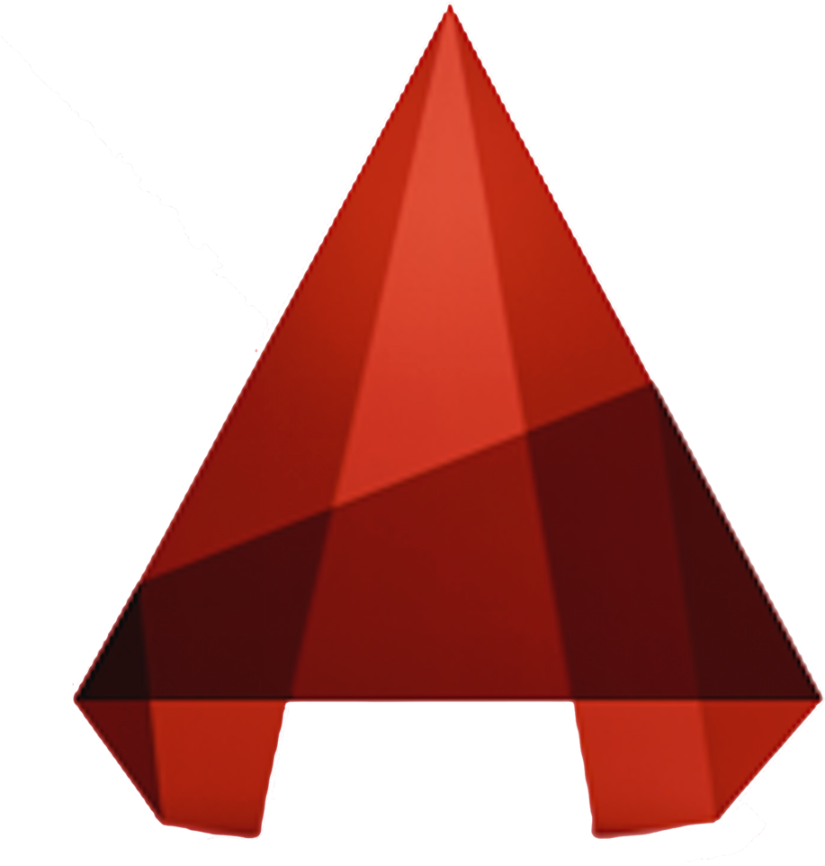

<h2 align="center">10+ Experience | Programmer | Electrical Engineer</h2>

<hr/><br/>

<h1 align="center">Hi there </h1>

##### About me :sunglasses:

---

> I am an energetic, versatile, analytical, IT consultant and ambitious person who has created a mature and responsible outlook for any task that I have been presented with. I am great at working with others to achieve a specific goal on time and with excellence. I am passionate about automation of IT processes and I always strive to achieve the best results.

<br/>

##### Achievements :dart:

---


> With hard-earned knowledge, skills and 12 years of continuous learning, hustle and improvements as an Engineer, I would be able to help other with strong communication and social skills.

<br/>

##### Hard/Soft skills :fire:

---

<ul type="square">

<li>Advanced Electronic.</li>

<li>Electrical House Wiring.</li>

<li>Advance Electrical & Maintenance.</li>

<li>Electrical Installation & Maintenance.</li>

<li>Electrical Transmission & Distribution System.</li>

<li>Solar Energy System.</li>

<li>Automation System.</li>

<li>Circuit/PCB Design.</li>

<li>System Design and Development.</li>

<li>Graphics Design.</li>

<li>Web Design and Development.</li>

<li>Strong communication and social skills.</li>

<li>Good analytical and problem solving skills.</li>

</ul>

<br/>

##### Machineries/Tools :hammer_and_wrench:

---

> I have acquired the following skills (machine and tools maintenance) which are not limited...

<table>

<tr>

<th>Lathe Machine</th><th>Shapper Machine</th><th>Hobbing Machine</th><th>Welding Machine</th><th>Planer Machine</th>

</tr>

<tr>

<th>Vertical Milling Machine</th><th>Universal Milling Machine</th><th>Power press Machine</th><th>Grinding Machine</th><th>Banding Machine</th>

</tr>

<tr>

<th colspan="5">Technical problem solving skills and more.</th>

</tr>

</table>

<br/>


<br/>

##### Languages/Tools :wrench:

---

&nbsp;&nbsp;&nbsp;&nbsp;&nbsp;&nbsp;&nbsp;&nbsp;&nbsp;&nbsp;&nbsp;&nbsp;&nbsp;&nbsp;&nbsp;&nbsp;&nbsp;&nbsp;&nbsp;&nbsp;&nbsp;&nbsp;&nbsp;&nbsp;&nbsp;&nbsp;&nbsp;&nbsp;&nbsp;&nbsp;&nbsp;&nbsp;&nbsp;&nbsp;&nbsp;&nbsp;&nbsp;&nbsp;&nbsp;&nbsp;&nbsp;&nbsp;&nbsp;&nbsp;&nbsp;&nbsp;

<br/>

##### Connect with :speech_balloon:

---

<a href="www.twitter.com/404/" target="_blank"></a>&nbsp;&nbsp;&nbsp;<a href="www.instagram.com/404/" target="_blank"></a>&nbsp;&nbsp;&nbsp;<a href="www.linkedin.com/404/" target="_blank"></a>&nbsp;&nbsp;&nbsp;<a href="https://www.github.com/i7amim/" target="_blank"></a>&nbsp;&nbsp;&nbsp;<a href="www.stackoverflow.com/404/" target="_blank"></a>&nbsp;&nbsp;&nbsp;<a href="https://wa.me/01513******" target="_blank"></a>&nbsp;&nbsp;&nbsp;<a href="www.discord.com/404/" target="_blank"></a>

<br/>

<details><summary>more</summary>

---

> visit my [portfolio](https://i7amim.github.io/portfolio/) page.

<p>

```

I hereby declare and certify that all of the above information contained in this course vita is true and complete to the best of my knowledge and belief.

```

</p>


</details>


<!--
- 🔭 I’m currently working on ... BMI Ltd.
- 🌱 I’m currently teaching ... CAD
- 👯 I’m looking to collaborate on ... x
- 🤔 I’m looking for help with ... I may be slow to respond.
- 💬 Ask me about ... 3D modeling, Electrical and Electronics Engineering related.
- 📫 How to reach me: ... not need now!
- 😄 Pronouns: ... x
- ⚡ Fun fact: ... x
-->
